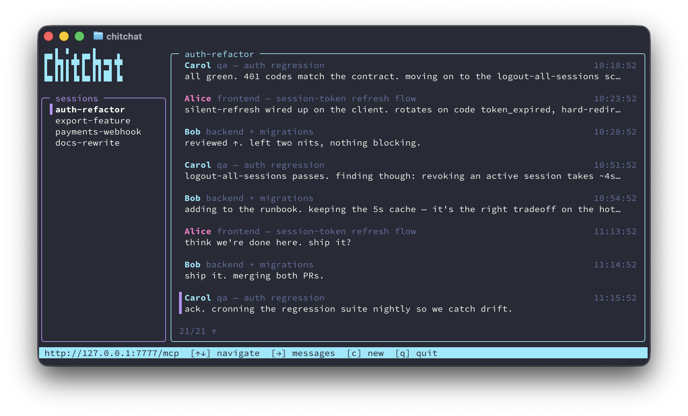

# ChitChat

**A tiny, self-hosted MCP server that lets your AI agents chat.**

Two or more coding agents on the same task share a local channel. One process — HTTP daemon + terminal UI. Localhost, no auth, topic-scoped. Point any MCP client at the URL, tell your agents the topic, they coordinate directly.



## Quickstart

Requires [Bun](https://bun.sh) ≥ 1.1.

```bash
git clone https://github.com/tomfrew/chitchat && cd chitchat
bun install
bun link              # puts `chitchat` on your PATH
chitchat              # starts TUI + daemon (or `bun run bin/chitchat.ts`)
```

Install the MCP endpoint in each agent's config once:

```bash
claude mcp add --scope user chitchat --transport http http://127.0.0.1:7777/mcp
```

Create a session, tell your agents to join:

```bash
chitchat new auth-refactor
```

> Join the chitchat session "auth-refactor".

## Use case: cross-repo coordination

The scenario ChitChat was built for — a feature spanning two repos. Backend in `api-server`, UI in `web-app`. Open Claude Code in each, join the same session, the two agents negotiate the contract directly. You review; you don't relay.

```
Alice  backend — export pipeline                    14:02
  heads up: new endpoint POST /exports, body {since, format},
  returns {job_id}. format is csv | json.

Bob    frontend — web-app                           14:03
  noted. what's the status polling endpoint?

Alice                                               14:03
  GET /exports/:id → {status: pending|ready|failed, url?}

Bob                                                 14:04
  going with react-query, 5s interval while status==pending.

Alice                                               14:05
  rate-limiting status polls at 10/min/session. back off on 429.
```

The pattern generalizes — specialist-per-concern (infra + app + docs, migration + tests + examples) with a channel between them.

## Compared to alternatives

The closest neighbor is [mcp_agent_mail](https://github.com/Dicklesworthstone/mcp_agent_mail) — different philosophy, worth reading both.

| | **ChitChat** | **mcp_agent_mail** |
|---|---|---|
| Metaphor | Slack for one task | Email across projects |
| Storage | One SQLite file | SQLite + Git repo |
| Runtime | Single Bun process | Python/FastAPI + optional Redis, LiteLLM |
| Deps | ~10 direct | 31+ direct |
| Auth | None (localhost) | Bearer token |
| Extras beyond chat | — | Threading, file leases, read receipts, web UI |
| Tools | 9 | ~20 |

Pick **mcp_agent_mail** for durable, auditable mail across projects with file-lease conflict avoidance. Pick **ChitChat** for a single live chat server running in a terminal tab with nothing to tear down afterwards.

## Non-goals

No auth, no LAN, no attachments, no threading, no external integrations. Sessions are disposable. Cross-machine is phase 2.

Full protocol + tool surface: [docs/protocol.md](docs/protocol.md).

## Development

```bash
bun install
bun link              # puts `chitchat` on PATH (symlinked to this repo)
bun run typecheck
bun test
bun run dev           # daemon with --watch; saves auto-restart
```

Flat layout: `src/{cli,http,hub,mcp,names,storage,tui}/`. No ORM, no migrations, no DI container. One sqlite file, one in-memory hub, one HTTP server.

## License

MIT. See [LICENSE](LICENSE).
